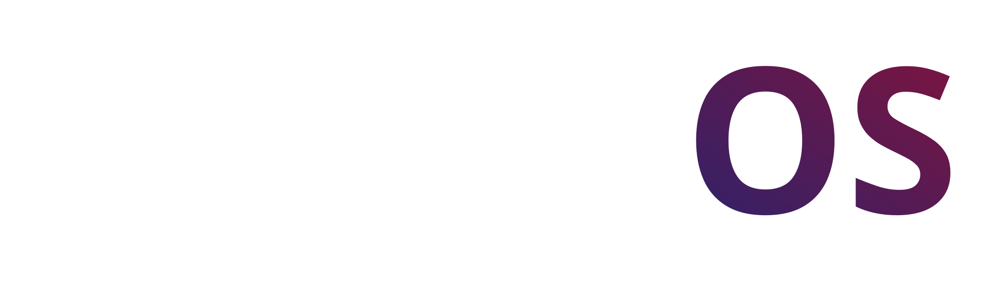
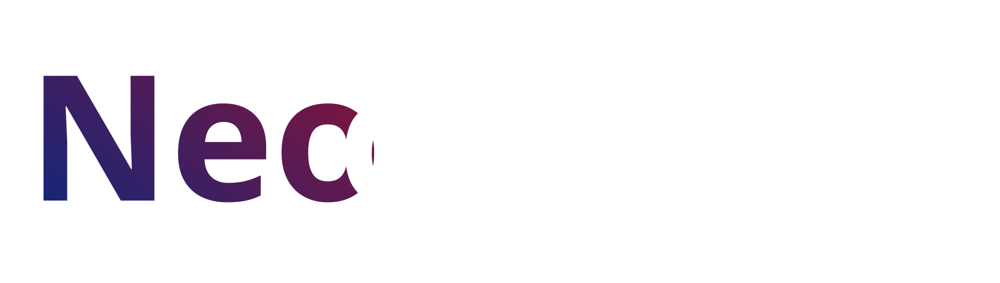
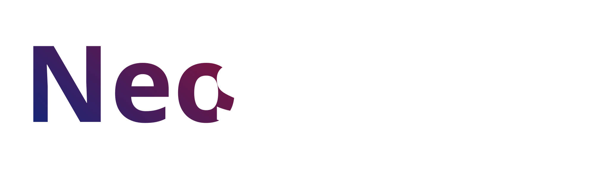

**NeoRixOS** is a lightweight, bloat-free Linux distro based on Arch, made for everyday use.

## Built on Arch Linux™

NeoRixOS runs on Arch Linux™ under the hood. Rolling release means your system is always current — no big version jumps, no reinstalls.

## What is nrx?

Arch Linux gives you pacman — powerful, but strictly single-purpose. If you ever need a package that only exists as a `.deb` or `.rpm`, or you just don't want to remember five different package managers' syntax, you're on your own.

**nrx** is NeoRixOS's answer to that: a single, unified command-line layer that sits on top of pacman (and, optionally, other package systems) so you interact with *one* interface no matter where a package comes from.

### How it works

nrx doesn't replace pacman — it directs traffic to it.

```
You type:  sudo nrx install firefox
nrx does:  pacman -S firefox
```

Under the hood, nrx is built around **backends** — small drivers, one per package system, each implementing the same basic operations (`install`, `remove`, `search`, `update`, `upgrade`, `info`). pacman is the native, always-present backend. Others (like Debian/Ubuntu `.deb` support) are optional and can be added or removed depending on what you need.

If you don't specify a backend, nrx defaults to pacman:

```
sudo nrx install firefox
     ↓ same as ↓
sudo nrx --pacman install firefox
```

If you want to be explicit, or use a non-native backend:

```
sudo nrx --pacman install firefox
sudo nrx --apt install some-package
```

### Foreign packages

nrx can also inspect and install packages from other ecosystems (like `.deb` files) without letting them interfere with your native Arch system. Before anything is installed, nrx shows you exactly what the package contains — its files, dependencies, and any install scripts — so you always know what you're agreeing to.

### System updates, too

nrx isn't just a package manager wrapper — it's also how NeoRixOS itself gets updated. It checks for new NeoRixOS releases, shows you what changed, and never installs anything without your explicit approval. Checking for an update, downloading it, and installing it are always three separate, user-controlled steps.

### Why it exists

The goal isn't to hide Linux's complexity from you — it's to stop making you learn five different tools to do the same basic things. You can still use pacman directly at any time; nrx is a convenience it recommends, never a requirement it enforces.

---

**NeoRixOS** currently offers two desktop environment editions:

-  **Neodymium (XFCE)** – Fast and light, essential apps only, and Firefox. Works well on older hardware too.
-  **Neosilicium (KDE Plasma)** – Fully customizable desktop with KDE's own app suite. Not bloat-free by nature, but trimmed down as much as possible.

Both editions run on the same Arch-based core. Different desktop, same system.

## These system builds are currently in development and not yet available.

---

# NeoRixOS Terms and Conditions

Welcome to NeoRixOS! By using, downloading, or distributing NeoRixOS, you agree to the following terms:

## 1. License

NeoRixOS is licensed under the **GNU General Public License v3 (GPLv3)**.
You are free to use, modify, and redistribute the software under the terms of this license.

## 2. Usage

- NeoRixOS is provided **as-is**. The developers are not responsible for any damage, data loss, or issues caused by using the software.
- You may create derivative works or build your own distributions based on NeoRixOS.

## 3. Logos and Images

- All NeoRixOS logos and images may be used for **personal purposes**, such as wallpapers or decorations.
- You may not use any NeoRixOS logos, images, or branding for **commercial purposes** without explicit permission.
- You may modify logos for personal projects in a non-commercial context.

## 4. No Warranty

NeoRixOS comes without any warranties. The developer make no guarantees about functionality, stability, or compatibility.
Use at your own risk.

## 5. Intellectual Property

- The NeoRixOS name and logos are owned by the creator (NeoRixOS).
- Referencing NeoRixOS in non-commercial projects is allowed.

## 6. Updates and Support

- NeoRixOS may provide updates and new ISO releases.
- Support is community-driven; no official technical support is guaranteed.

## 7. Changes to Terms

NeoRixOS may update these Terms and Conditions. By continuing to use the software, you accept any changes.

---

# NeoRixOS Privacy Policy

Your privacy is important to the developer of NeoRixOS. This policy explains what information is collected and how it is used.

## 1. Information Collection

- NeoRixOS **does not collect any personal data**.
- Downloading ISOs or accessing the website does **not require registration or personal information**.

## 2. Third-Party Services

- NeoRixOS may link to external services (e.g., GitHub, Netlify) for downloads or contributions.
- The privacy policies of these services apply when you use them.

## 3. Your Rights

- Since no personal data is collected, there is nothing stored that you need to request deletion for.

## 4. Changes to this Policy

- This Privacy Policy may be updated over time.
- Continued use of NeoRixOS or the website implies acceptance of any updates.

---

# Trademark Policy

Last updated: 2026

## NeoRix Name & Logo

- The NeoRix name and its logos are owned by the NeoRix project. You may reference the NeoRix name in non-commercial contexts freely. You may not use the NeoRix name or logo to imply official endorsement or affiliation without permission.

## Arch Linux™

- NeoRix is based on Arch Linux™. The Arch Linux name and logo are trademarks of Judd Vinet and Aaron Griffin. NeoRix is an independent project and is not affiliated with, endorsed by, or sponsored by the Arch Linux project.
- Use of the Arch Linux™ name on this website is solely to indicate that NeoRix is derived from Arch Linux, as permitted under Arch Linux's trademark policy.

## Firefox

- Firefox is a trademark of the Mozilla Foundation. NeoRix includes Firefox as a default browser in its editions. This does not imply any affiliation with or endorsement by Mozilla.

## KDE Plasma

- KDE and the KDE logo are registered trademarks of KDE e.V. The NeoRix Neosilicium edition is built on KDE Plasma. This does not imply any affiliation with or endorsement by KDE e.V.

## XFCE

- XFCE is the trademark of its respective project. NeoRix uses this desktop environment in its Neodymium edition without implying any official relationship with its organization.

## Other Trademarks

- All other trademarks, product names, and company names mentioned on this site are the property of their respective owners
